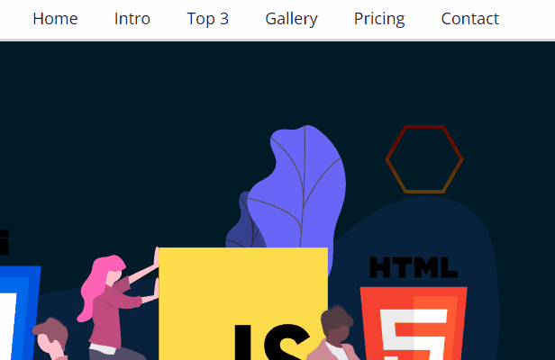

# Landing Page de Revisão 

*Landing Page básica com intuito de revisar conhecimentos passados e implementar novos*

<table>
  <thead>
    <tr>
      <th>Visão Geral</th>
    </tr>
  </thead>
  
  <tbody>
    <tr>
      <td></td>
    </tr>
  </tbody>
</table>

<table>
  <thead>
    <tr>
      <th>Navegação através do menu</th>
      <th>Animações do menu</th>
    </tr>
  </thead>
  
  <tbody>
    <tr>
      <td></td>
      <td></td>
    </tr>
  </tbody>
</table>

- **Tecnologias Foco:**  
✔ HTML  
✔ CSS

🔗 <a href="https://jeanpcb.github.io/Landing-Page-Revisao/">Clique aqui pra conferir</a> 😉

## Descrição

Landing page básica criada com o intuito de revisar conceitos de:
- HTML => estruturação e organização dos elementos HTML, acessibilidade
- CSS => responsividade, utilização de variáveis, animações utilizando pseudo-elementos (after e before), seletores e especificidade, Flexbox e Grid
